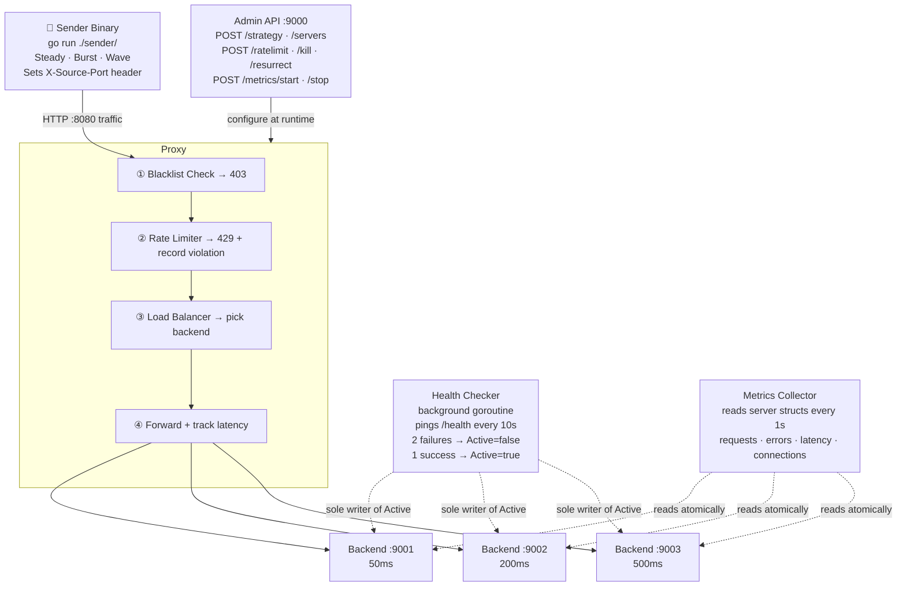
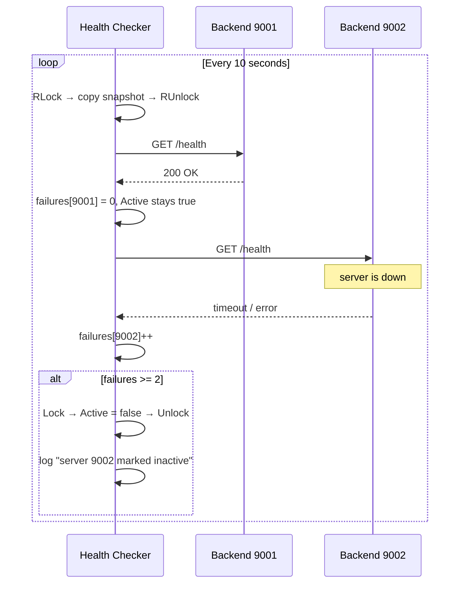

<div align="center">

# Proximo

**A reverse proxy built from scratch in Go to understand and test real load balancing and rate limiting algorithms.**

[](https://go.dev)


[What is it](#what-is-it) · [Quick Start](#quick-start) · [Architecture](#architecture) · [Load Balancing](#load-balancing-algorithms) · [Rate Limiting](#rate-limiting-algorithms) · [Health Checking](#health-checking) · [Admin API](#admin-api) · [Design Decisions](#design-decisions) · [What I Learned](#what-i-learned)

</div>

---

## What is it

Proximo is a reverse proxy built from scratch in Go — the thing NGINX, HAProxy, and AWS ALB do in production. It was built to go beyond configuration and understand how these systems actually work at the code level.

The core idea: implement real load balancing and rate limiting algorithms, fire real HTTP traffic through them with a separate sender binary, and measure the differences. The same 30 seconds of traffic at 30 req/s through **round robin vs least connections produces 248ms vs 98ms average latency** — a 2.5x difference that is invisible until you measure it.

**What it includes:**
- 5 load balancing algorithms — round robin, weighted, least connections, power of two choices, canary
- 4 rate limiting algorithms — token bucket, sliding window, leaky bucket, concurrent limiter
- Automatic health checking with resurrection — 2-failure threshold, background goroutine
- Live metrics — per-server requests, errors, connections, avg latency tracked in real time
- Separate sender binary — steady, burst, and wave traffic patterns to drive meaningful comparisons

Everything configured through an admin HTTP API at runtime. No config files, no restarts.

---

## Quick Start

```bash
# Terminal 1 — start the proxy
go run main.go

# Terminal 2 — set strategy first, then add servers
curl -X POST localhost:9000/strategy \
  -H "Content-Type: application/json" \
  -d '{"strategy": "least-conn"}'

curl -X POST localhost:9000/servers \
  -H "Content-Type: application/json" \
  -d '[
    {"port": 9001, "latency_ms": 50,  "capacity": 50, "error_rate": 0, "weight": 3},
    {"port": 9002, "latency_ms": 200, "capacity": 20, "error_rate": 0, "weight": 2},
    {"port": 9003, "latency_ms": 500, "capacity": 5,  "error_rate": 0, "weight": 1}
  ]'

# Terminal 3 — fire traffic and watch the live metrics
go run ./sender/
```

> **Order matters** — always set strategy before adding servers.

**Live metrics output while the test runs:**

```
[t=10s] Total: 272 | Forwarded: 272 | Rejected: 0 | Errors: 0
  9001 [up]: 216 req | 0 err | 0 conns | avg 50ms
  9002 [up]: 39  req | 0 err | 1 conns | avg 200ms
  9003 [up]: 17  req | 0 err | 1 conns | avg 500ms

[t=30s] Final Summary
Server   Requests   Errors   Error%   Avg ms
9001     694        0        0.0      50
9002     125        0        0.0      200
9003     53         0        0.0      500
Total    872        0        0.0      98
```

---

## Architecture



**Request pipeline inside the proxy:**

```
Incoming request
  → ① Blacklist check     — 403 if client port is blacklisted
  → ② Rate limit check    — 429 if over limit, record violation (blacklist at 10)
  → ③ Load balancer       — NextServer() picks from Active=true backends only
  → ④ Forward             — callBackend(), record latency, stream response back
```

**Port map:**

| Service | Address |
|---------|---------|
| Traffic | `localhost:8080` |
| Admin API | `localhost:9000` |
| Backend 1 | `localhost:9001` |
| Backend 2 | `localhost:9002` |
| Backend 3 | `localhost:9003` |

---

## Load Balancing Algorithms

### Benchmark Setup

Three backends simulating a realistic mixed fleet. Same traffic through every algorithm: **30 req/s steady for 30 seconds, backends at 50ms / 200ms / 500ms latency**.

### Results — All Algorithms

| Algorithm | 9001 req | 9002 req | 9003 req | Total req | Avg latency |
|-----------|----------|----------|----------|-----------|-------------|
| Round Robin | 294 | 295 | 294 | 883 | **248ms** |
| Weighted (3:2:1) | 445 | 297 | 148 | 890 | **174ms** |
| P2C | 506 | 249 | 122 | 877 | **154ms** |
| Least Conn | 694 | 125 | 53 | 872 | **98ms** |

**Key takeaway:** Same traffic, same backends, same duration. Least conn is **2.5x faster** than round robin.

Round robin is completely blind — it sends equal traffic to all three regardless of speed, so the slow server drags the average up. Weighted is smarter because the 3:2:1 split biases more traffic toward the fast server by design — but the weights are static, so it cannot adapt when load shifts. P2C adapts dynamically with O(1) selection. Least conn adapts dynamically with full visibility — it sees that 9001 finishes requests instantly and keeps routing there, producing the best result.

The progression tells the story: **248ms → 174ms → 154ms → 98ms**. Each step adds more intelligence about current server state.

### Canary Routing

New version on one server. N% of traffic goes there, rest to stable via round robin. If the canary returns 500, the forwarder retries transparently on a stable server via `NextStable()` — the client never sees the failure. If error rate exceeds the threshold, canary is marked unhealthy and all traffic routes to stable automatically.

```bash
curl -X POST localhost:9000/strategy \
  -H "Content-Type: application/json" \
  -d '{
    "strategy": "canary",
    "canary_port": 9003,
    "canary_percent": 10,
    "error_threshold": 0.1
  }'
```

### Algorithm Reference

| Algorithm | Best for | Time complexity | Load awareness |
|-----------|----------|-----------------|----------------|
| Round Robin | Identical servers, uniform cost | O(1) | None |
| Weighted | Mixed hardware capacity | O(1) | Static weights |
| Least Conn | Variable request duration | O(n) | Current connections |
| P2C | Large fleets, variable duration | O(1) | Current connections |
| Canary | Zero-downtime deployments | O(1) | Error rate |

---

## Rate Limiting Algorithms

Client identity is the `X-Source-Port` header set by the sender. After 10 violations the client is permanently blacklisted — subsequent requests get 403 before even touching the rate limiter.

### Benchmark Setup

Same traffic through each algorithm: **steady 20 req/s for 30 seconds, fixed port 7001, limit 5 req/s**.

### Results — All Algorithms

| Algorithm | Config | Forwarded | Rejected | Burst behavior |
|-----------|--------|-----------|----------|----------------|
| Token bucket | 5 req/s, bucket 10 | 16 | 577 | ✅ Bucket absorbs initial burst |
| Sliding window | 5 req/s, window 1s | 5 | 582 | ❌ Strict 5/s from first request |
| Leaky bucket | 5 req/s, queue 10 | 16 | 569 | ✅ Queue absorbs initial burst |
| Concurrent | max 5 in-flight | 5 | 25 | N/A — limits concurrency not rate |

Token bucket and leaky bucket both forwarded ~16 because their capacity of 10 absorbs the burst before throttling kicks in. Sliding window is the strictest — only 5 got through, no burst tolerance at all. Concurrent limiter is a different concept entirely — it caps simultaneous in-flight requests, not the request rate.

### Token Bucket

Each client has a bucket of tokens refilling at a fixed rate. Each request costs one token. Empty bucket → 429. Allows bursting up to bucket capacity then throttles. Refill is lazy — calculated on arrival, no background goroutine needed. **What Stripe uses in production.**

```bash
curl -X POST localhost:9000/ratelimit \
  -H "Content-Type: application/json" \
  -d '{"algorithm": "token-bucket", "requests_per_second": 10, "bucket_size": 20}'
```

### Sliding Window

Keeps a timestamp list per client. On each request: evict timestamps older than the window, count remaining, reject if at limit. No hard resets — eliminates the boundary attack where a client sends double traffic straddling a window edge. **Most accurate algorithm.**

```bash
curl -X POST localhost:9000/ratelimit \
  -H "Content-Type: application/json" \
  -d '{"algorithm": "sliding-window", "requests_per_second": 10, "window_seconds": 1}'
```

### Leaky Bucket

Queue per client draining at a fixed rate via background goroutine. Queue full → 429. Output is always smooth regardless of input spikes. The only algorithm here that requires a background goroutine. **Used in network traffic shaping.**

```bash
curl -X POST localhost:9000/ratelimit \
  -H "Content-Type: application/json" \
  -d '{"algorithm": "leaky-bucket", "requests_per_second": 10, "bucket_size": 20}'
```

### Concurrent Limiter

Limits simultaneous in-flight requests per client — not rate, concurrency. One slow client cannot hold all connections open no matter how slowly they send. Requires `Done()` after each response to decrement the counter. **Solves the slow loris attack.**

```bash
curl -X POST localhost:9000/ratelimit \
  -H "Content-Type: application/json" \
  -d '{"algorithm": "concurrent", "max_concurrent": 5}'
```

---

## Health Checking

Background goroutine completely separate from the request path. Never blocks incoming traffic.



The health checker is the **only writer** of `Active`. Originally `Shutdown()` also set it — this caused a silent bug where the checker saw the flag was already false and skipped logging. Single writer pattern fixed it.

```bash
# Kill a backend — health checker marks inactive within 20 seconds
curl -X POST localhost:9000/kill \
  -H "Content-Type: application/json" \
  -d '{"port": 9002}'

# Resurrect — health checker confirms recovery on next successful ping
curl -X POST localhost:9000/resurrect \
  -H "Content-Type: application/json" \
  -d '{"port": 9002}'
```

Real output from a kill → resurrect cycle:
```
16:58:26 — killed 9002
16:58:42 — [health] server 9002 marked inactive after 2 failures
16:59:09 — resurrected manually
16:59:12 — [health] server 9002 resurrected
```

---

## Admin API

| Method | Endpoint | Body | Description |
|--------|----------|------|-------------|
| POST | `/strategy` | `{"strategy": "..."}` | Set load balancing algorithm |
| POST | `/servers` | `[{port, latency_ms, capacity, error_rate, weight, is_canary}]` | Add backends |
| POST | `/ratelimit` | `{"algorithm": "...", ...params}` | Set rate limiter |
| POST | `/blacklist` | `{"port": "7001"}` | Manually blacklist a client |
| GET | `/blacklist` | — | View blacklist and violation counts |
| POST | `/kill` | `{"port": 9002}` | Shut down a backend |
| POST | `/resurrect` | `{"port": 9002}` | Restart a backend |
| POST | `/metrics/start` | — | Start live display |
| POST | `/metrics/stop` | — | Stop display + print final summary |
| POST | `/shutdown` | — | Graceful shutdown of everything |

**Strategies:** `round-robin` · `weighted` · `least-conn` · `p2c` · `canary`

**Rate limiters:** `token-bucket` · `sliding-window` · `leaky-bucket` · `concurrent`

---

## Design Decisions

| Decision | Why |
|----------|-----|
| Standard library only | No external frameworks. Every line is explicit. Understanding the algorithms is the point — hiding them behind abstractions defeats the purpose. |
| `backends` is `*[]*Server` | Pointer to slice so all balancers see appends immediately without extra notification. When the proxy adds a server, every balancer picks it up. |
| Health checker is sole writer of `Active` | Single writer pattern eliminates a silent bug: `Shutdown()` was setting `Active = false` before the checker ran, so the checker saw it was already false and skipped logging entirely. |
| Snapshot pattern in health checker | RLock → copy slice → RUnlock → ping outside lock. A ping to a dead server blocks for seconds. Holding the mutex that long would block every incoming request on the hot path. |
| Connections tracked in forwarder, not balancers | Forwarder always increments after `NextServer()` and decrements via defer. Previously only least conn incremented it — other algorithms showed negative values. Moving it to the forwarder keeps the counter balanced for all algorithms. |
| `Done()` on Limiter interface | No-op for three algorithms, real decrement for concurrent limiter. One `defer limiter.Done()` in the forwarder handles all four cases without type assertions. |
| Sender is separate binary | Independent process over real HTTP. More realistic — in production the load generator is never part of the load balancer. Also makes it easy to run multiple senders simultaneously. |
| X-Source-Port as client identity | Cannot use different IPs locally. Port is the next best proxy. Fixed port mode makes violations accumulate for blacklist demos. Random mode means rate limiting never triggers — useful for clean load balancing tests. |

---

## What I Learned

The most surprising thing building this was how invisible algorithm differences are until you actually measure them. Reading that least connections outperforms round robin under variable load is one thing — watching 9003 pile up 5 in-flight connections while round robin keeps routing to it anyway makes it concrete in a way that no explanation does. The progression **248ms → 174ms → 154ms → 98ms** across the four algorithms shows exactly how much intelligence about current server state is worth.

The bugs were also more interesting than expected. The health checker never logged "marked inactive" for the first few days. The fix turned out to be a single writer problem — `Shutdown()` was setting `Active = false` before the checker ran, so the checker silently skipped the log because the condition was already met. Once the health checker became the sole writer the behavior was immediate and correct. This is the kind of concurrency subtlety that only shows up when you build the system yourself.

The rate limiting comparison was the other revelation. Token bucket and sliding window feel similar in theory but behave completely differently under burst traffic — token bucket lets the first 10 through immediately, sliding window holds the line from the very first request. The difference only becomes clear when you measure it.

---

## File Structure

```
proximo/
  main.go                   entry point — proxy.New() + proxy.Start()

  backends/
    server.go               Server struct · Start() · Shutdown()

  balancer/
    balancer.go             Balancer interface + factory
    roundrobin.go           atomic counter modulo active servers
    weighted.go             smooth NGINX weighted algorithm
    leastconn.go            scan for minimum Connections
    poweroftwo.go           pick 2 random, compare Connections
    canary.go               percent routing + NextStable() for transparent retry

  proxy/
    server.go               Proxy struct · all admin handlers
    forwarder.go            forward() · callBackend() · latency tracking

  ratelimit/
    limiter.go              Limiter interface — Allow() + Done()
    tokenbucket.go          lazy refill, float64 tokens
    slidingwindow.go        timestamp list per client, lazy eviction
    leakybucket.go          queue depth + drain goroutine
    concurrent.go           inflight count, Done() decrements
    blacklist.go            violation tracking + auto blacklist at threshold 10

  health/
    checker.go              background goroutine · snapshot pattern · 10s interval

  metrics/
    collector.go            reads server structs atomically every 1s
    display.go              live output + final summary · stop channel

  config/
    config.go               ServerConfig · StrategyConfig · RateLimitConfig

  sender/
    main.go                 interactive menu · metrics start/stop calls
    sender.go               Steady · Burst · Wave patterns
```